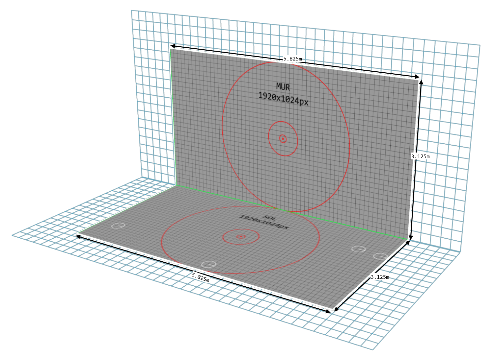
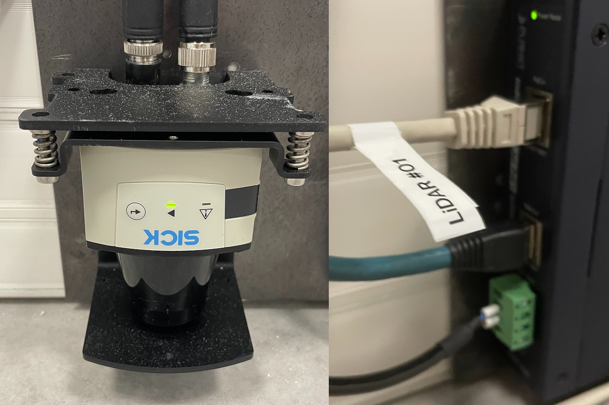
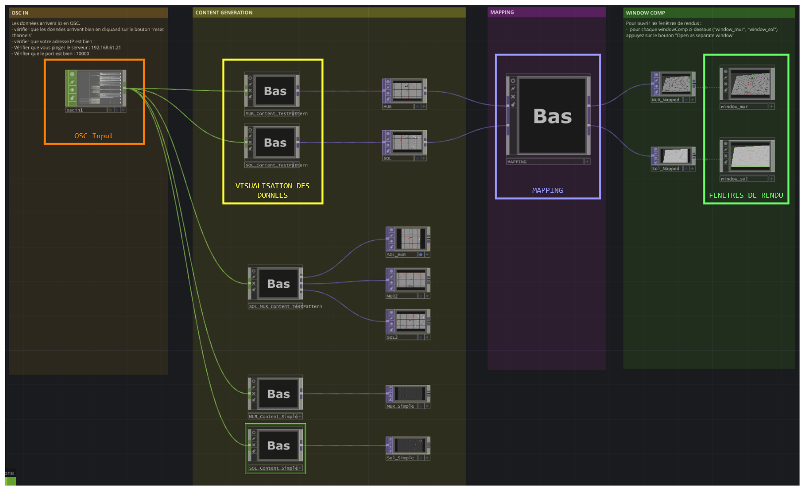
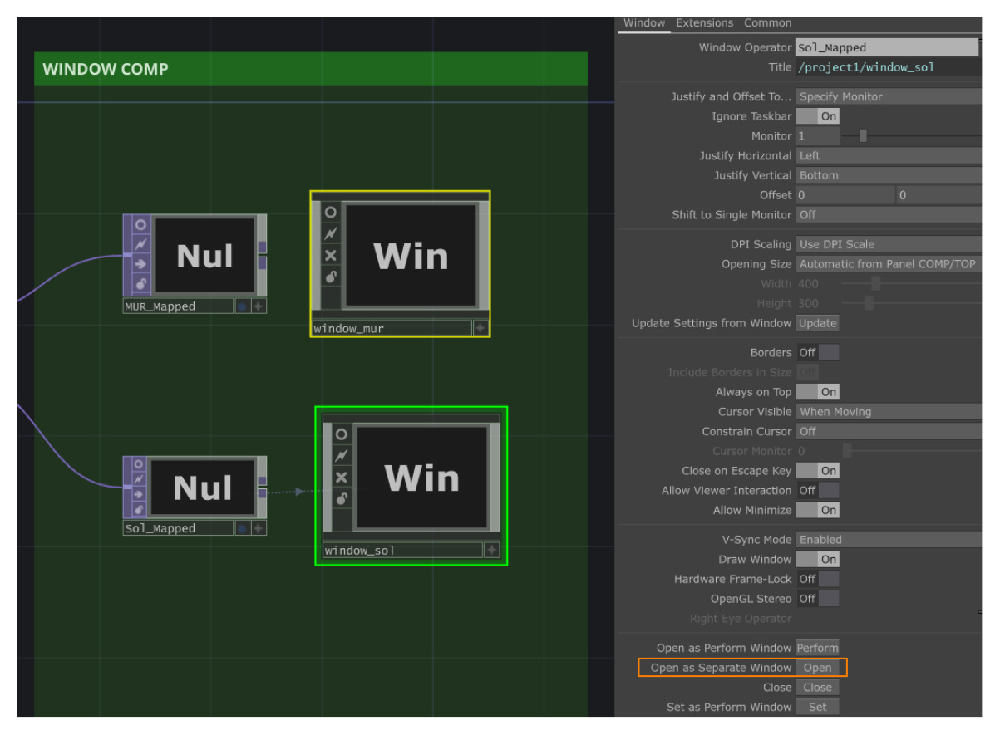
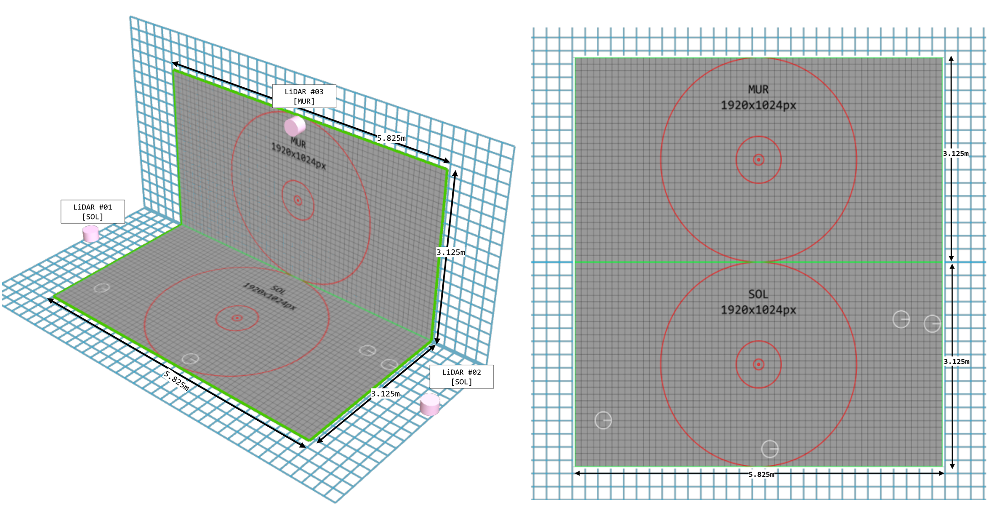
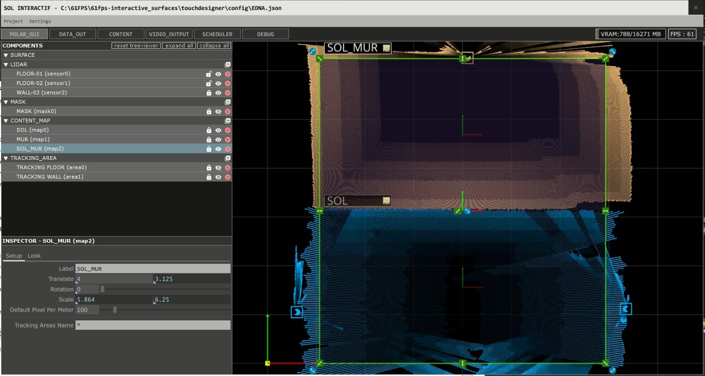
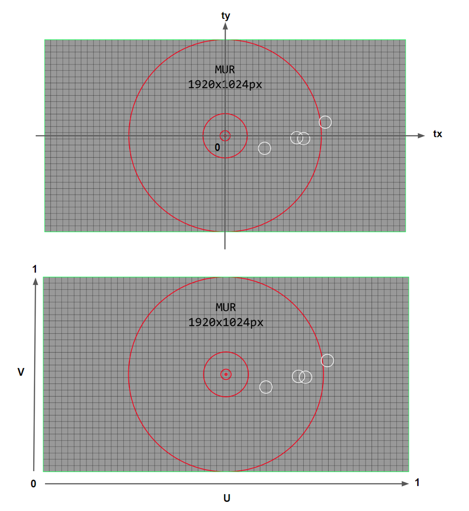

# TD_lidar_A503

## Les surfaces

Plan des surfaces de tracking et de projection : 


Les deux surfaces font la même taille : 5.825m x 3.125m. Des contenus à la résolution de 1920 x 1024 pixels sont nécessaires pour respecter l’aspect ratio des surfaces. 

**Surface 1 : Le sol**

- Il permet le tracking de plusieurs personnes (les pieds) dans la zone au sol.
- Il est composé de 2 capteurs LiDAR pour une meilleure définition du tracking. Les deux capteurs sont installés en miroir, l’un en face de l’autre afin de réduire les occlusions.
- Un maximum de 20 blobs sont détectés.

**Surface 2 : Le mur**

- Il permet le tracking des mains sur la zone au mur.
- Il est composé de 1 capteur LiDAR fixé au mur, en haut de la surface interactive.
- Un maximum de 10 blobs sont détectés

## La mise en route du système de tracking

<details>
<summary><b> Checklist de démarrage </b></summary>

- Allumer les projecteurs video avec la télécommande.
- Vérifier que les keystones des projecteurs sont bien à la valeur par défaut (0)
- Vérifier que le serveur de tracking est sous tension
- Vérifier que le switch Ethernet est sous tension (dans la baie en hauteur)
- Allumer le serveur Tracking → Procédure de démarrage bouton ou Anydesk
- Vérifier que les lidars sont branchés et que la led centrale est allumée en vert



</details>

### Réseau 

Le serveur de tracking traite les données des capteurs pour les rendre accessible en OSC et Websocket : pour récupérer les données il faut se connecter au réseau en filaire (prise Rj45).

Choisir une des 4 adresses OSC pour configurer votre carte reseau en adresse ip statique : 

| Appareil | Adresse IP |
| --- | --- |
| OSC #1 | 192.168.61.31 |
| OSC #2 | 192.168.61.32 |
| OSC #3 | 192.168.61.33 |
| OSC #4 | 192.168.61.34 |

Masque de sous-réseau : 255.255.255.0

Pour vérifier qu'on se connecte bien au serveur de tracking, ouvrir le Terminal et essayer de ping le serveur avec `ping 192.168.61.21`

### Sorties vidéos

3 sorties : 
- sortie 0 : l'écran de l'ordi
- sortie 1 : le sol 1920*1080
- sortie 2 : le mur 1920*1080


Source : la [documentation du système lidar de la salle A5-03 de 61fps](https://www.notion.so/Documentation-du-syst-me-de-tracking-LiDAR-l-atelier-num-rique-691a27efb6aa4253a0eff5b101708021).

### Ouvrir TouchDesigner

Le project exemple est `mainLidar.toe`, ou celui de [61fps](https://github.com/61FPS/EDNA-lidar_tracking_tools).



Pour s’assurer que les données arrivent bien, sélectionnez le `OSCin` CHOP (rectangle orange sur le screen) et cliquez sur le bouton pulse “reset channels” puis vérifier que les données réapparaissent bien dans le viewer.

Si aucune données n’est reçue : 

- Essayer de désactiver puis réactiver l’OSC in
- Vérifier l’adresse IP du PC projet
- Pinger le PC serveur
- Désactiver le pare-feu
- Redémarrer le PC projet.

Ouvrir les sorties vidéos en cliquant sur le bouton pulse “Open as separate window” :


## Simulateur

Le simulateur de Valentin : mettre lien

## Données

## Projet de base

Fichier : mainLidar.toe

## Détection de zones

Fichier : 2DcollisionLIDARV2.toe

## Informations techniques

### Dimensions



| Nom | Largeur physique | Hauteur physique | Largeur de l’image | Hauteur de l’image | Nombre de blobs maximum |
| --- | --- | --- | --- | --- | --- |
| Mur | 5.825 mètres | 3.125 mètres | 1920 pixels | 1024 pixels | 10 |
| Sol | 5.825 mètres | 3.125 mètres | 1920 pixels | 1024 pixels | 20 |
| Mur & Sol | 5.825 mètres | 6.25 mètres | 1920 pixels | 2048 pixels | 30 (10+20) |

### Matériel

- 2 x  vidéoprojecteurs
- 3 x capteurs Lidars + splitter POE
- 1 x switch + 1 x Serveur (Tracking)

### Lidars

Les LiDARs sont fixés sur une platine vissée dans le mur. Une prise ethernet dans le mur est reliée au switch et permet d’alimenter l’appareil ainsi que de transmettre les données. Le câble ethernet doit être branché dans la prise POE in du boîtier splitter POE. Une lumière sur le splitter s’allume quand une tension est détectée. Pendant la procédure d’allumage des LiDARS une LED rouge clignotte puis une autre passe au vert indiquant le bon fonctionnement. 

Les LiDARs sont numérotés de 1 à 3 et leur emplacement est indiqué à côté de la prise ethernet.

### Software



L’application de tracking s'allume directement au démarrage du PC. 

Si un redémarrage de l'application devrait être effectué, quittez l’application puis redémarrez là avec le raccourci nommé “start_app_player” situé sur le bureau Windows.

### Adressage IP

### Adressage IP

| Appareil | Adresse IP | Commentaire |
| --- | --- | --- |
| Serveur TRACKING | 192.168.61.21 | Installé dans la baie informatique. Serveur websocket sur le port 8080 |
| LiDAR #1 | 192.168.61.201 | SOL (celui de gauche, lorsque l’on est face au mur) |
| LiDAR #2 | 192.168.61.202 | SOL (celui de droite, lorsque l’on est face au mur) |
| LiDAR #3 | 192.168.61.203 | MUR |
| OSC #1 | 192.168.61.31 | Port 10000 |
| OSC #2 | 192.168.61.32 | Port 10000 |
| OSC #3 | 192.168.61.33 | Port 10000 |
| OSC #4 | 192.168.61.34 | Port 10000 |


### Blobs et données

Le système de tracking permet de récupérer la position d’objet détecté - ou **blob**- dans les surfaces interactives.

Voici la nomenclature et définition de chaque donnée :

| Nom | Description | Type | Interval |
| --- | --- | --- | --- |
| `id` | Numéro d’identification du blob. Lorsqu’il est à 0 le blob est inactif. | Int | [1 ; +∞] |
| `tx` | Coordonnée en x dans le repère monde. | Float | [ - ScaleX / 2 ; ScaleX / 2 ] |
| `ty` | Coordonnée en y dans le repère monde. | Float |  [- ScaleY / 2 ; ScaleY / 2 ] |
| `u`  | Coordonnée en x normalisé dans l’espace de la zone | Float | [ 0 ; 1] |
| `v` | Coordonnée en y normalisé dans l’espace de la zone | Float | [ 0 ; 1] |

Un blob avec son id égal à 0 correspond à un blob inactif.

### Repère des données

Pour les coordonnées `(tx, ty)`, l’origine du repère est au centre de la zone rectangulaire et les mesures sont en mètres.

Pour les coordonnées `(u, v)` , l’origine est le coin en bas à gauche de la zone de tracking rectangulaire.



### OSC : Format des données

```
/<nom_de_la_surface>/specs/ #Informations sur la zone interactive (content map)
/<nom_de_la_surface>/specs/Scalex #Largeur en mètres de la zone interactive (content map)
/<nom_de_la_surface>/specs/Scaley #Hauteur en mètres de la zone interactive (content map)

/<nom_de_la_surface>/blobs/   #Blobs informations
/<nom_de_la_surface>/blobs/blob<id_du_blob>/id #Id du blob (entier)
/<nom_de_la_surface>/blobs/blob<id_du_blob>/tx #Coordonnées du blob dans le repère monde (x)
/<nom_de_la_surface>/blobs/blob<id_du_blob>/ty #Coordonnées du blob dans le repère monde (y)
/<nom_de_la_surface>/blobs/blob<id_du_blob>/u #Coordonnées du blob dans le repère normalisé (x)
/<nom_de_la_surface>/blobs/blob<id_du_blob>/v #Coordonnées du blob dans le repère normalisé (y)
```

<nom_de_la_surface> : Label de la content map concernée.

- SOL : content map #0 correspondant au sol
- MUR : content map #1 correspondant au mur
- SOL_MUR : content map #2 correspondant à la surface du sol et du mur comme un seul plan.

<id_du_blob> : Chiffre entier commençant à 0

### Websocket : Format des données

Un serveur websocket est intégré au système. Il envoie les données au format JSON.

| Adresse IP | Port | Format |
| --- | --- | --- |
| 192.168.61.21 | 8080 | JSON |


```json
{
		// Dictionnaire des zones d'intéractions
		// map_name : map_data
    "map0": {
				// map infos
        "map": {
            "name": "map0",
            "label": "SOL",
            "sizex": 5.864,
            "sizey": 5.864
        },
				// blobs list
        "blobs_data": [
						// blob information
            {
                "id": 0,
                "tx": -4,
                "ty": -1.562,
                "u": -0.182,
                "v": 0
            },
						...
				]
		},
		...
}
```

### Glossaire

**Blob**

Un blob est un point dans l’espace correspondant à un objet détecté dans la zone d’interactivité. Un objet assez grand dans la zone d’interaction bloquant les rayons des lidars provoque sa détection, on prend donc le centre de cet amas de point détecté et on envoie le centre.

**Tracking area**

La tracking area est la zone rectangulaire dans laquelle on effectue le blobtracking à partir des données d'un ou plusieurs LIDAR. Elle doit donc englober toute la zone où l'on veut détecter des mouvements. 

**Content Map**

La content map est la texture complète représentant le contenu qui est créé, sa résolution en pixels est définie arbitrairement et indépendante du nombre de projecteurs et de leurs résolutions.

Son ratio est égal au ratio physique de la zone de projection. Exemple: si la zone de projection rectangulaire fait 3x1m, la content map, pourrait faire 3000x1000px.

**Mapping**

Le mapping est le fait de déformer l’image de sortie des projecteurs afin de l’ajuster à la zone physique. Elle est délimitée par des marques au feutre noir sur le sol et sur le mur.